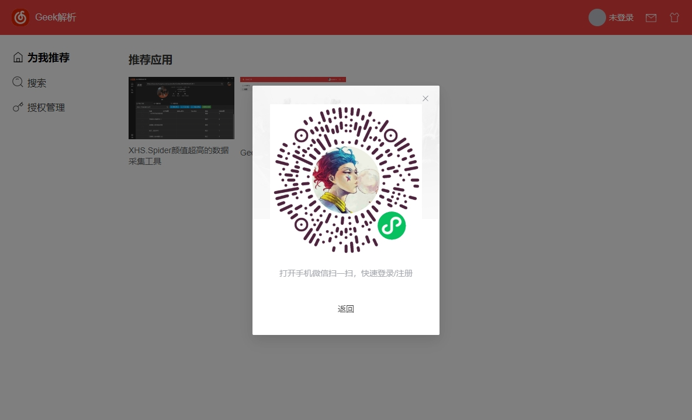
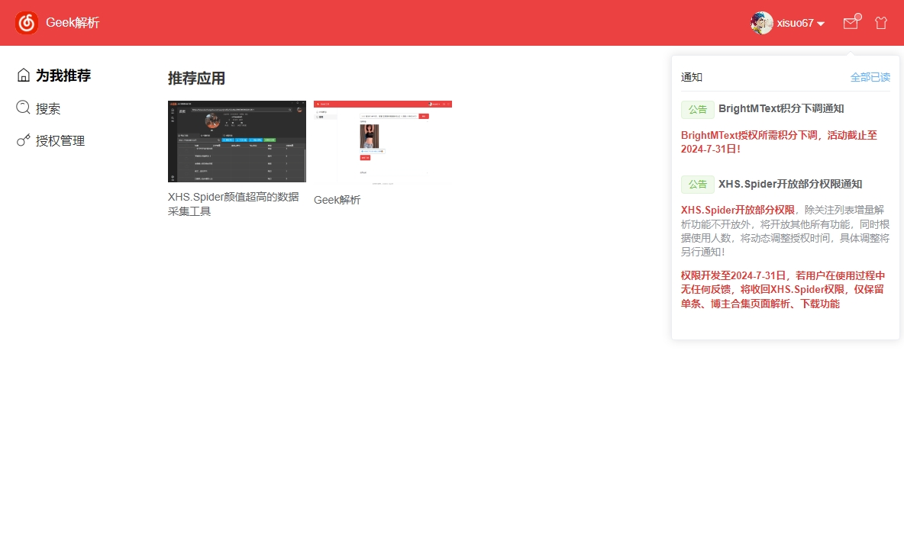
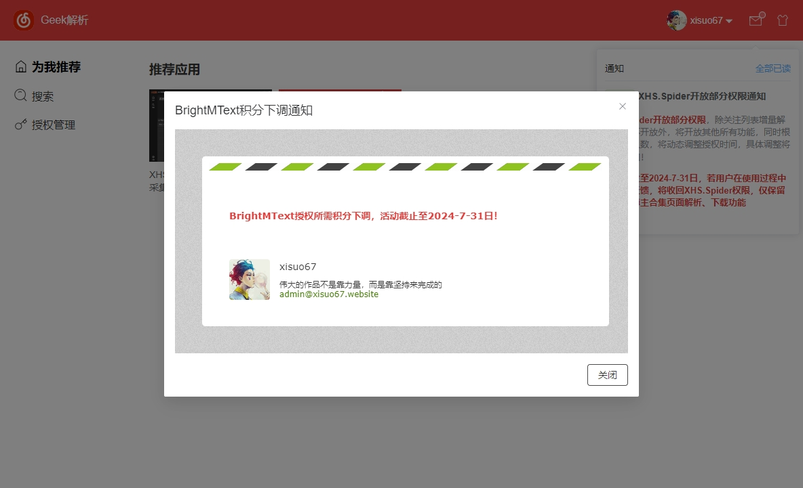
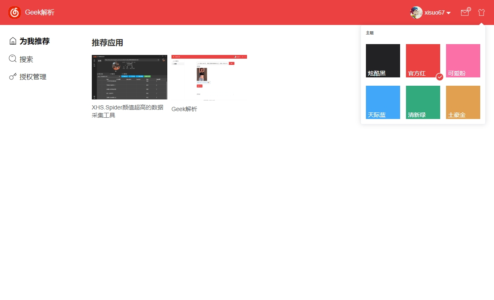
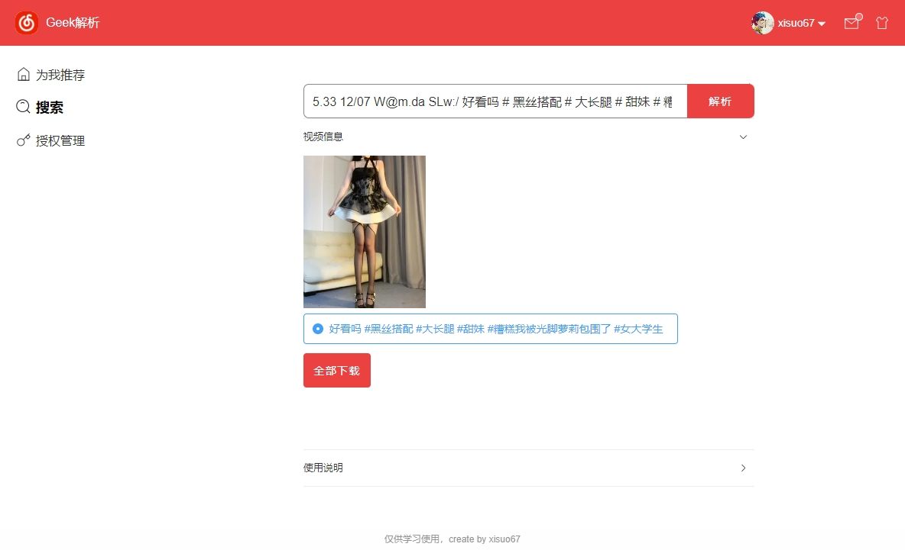
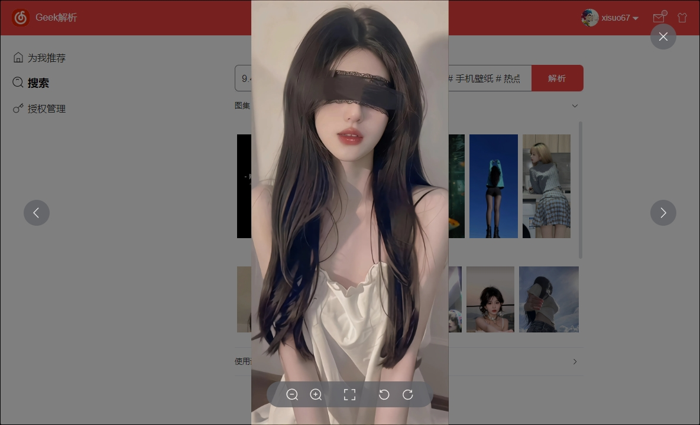

  

<h1 align="center">Geek解析</h1>

<h4 align="center">这是一个学习wails的项目，使用 Go 构建漂亮的跨平台应用程序！ 前端框架由<a href="https://github.com/xisuo67/Wails-Tool-Template">本人另外一个开箱即用的桌面客户端解决方案基础上搭建而来（仿网易云客户端）</a></h4>

    

    
    
    
    

<table>
    <tr>
        <td></td>
        <td></td>
    </tr>
    <tr>
        <td></td>
        <td></td>
    </tr>
        <tr>
        <td></td>
        <td></td>
    </tr>
</table>

## 支持

> 支持抖音,皮皮虾,火山,微视,最右,快手,全民小视频,皮皮搞笑,西瓜视频,虎牙,梨视频,acfun,好看视频...
>
> 参考[parse-video](https://github.com/wujunwei928/parse-video)

## 说明

> 这是一个基于wails的跨平台开箱即用的桌面客户端解决方案，同时是一个仿网易云的客户端，旨在学习wails以及回顾几年没用的go语法。
>
> **程序仅供学习使用**，并且这个项目也仅仅是一次使用wails编译跨平台客户端的尝试。未来将尝试在这个框架上使用自动更新及其他技术，慢慢打磨这个框架，从而孵化其他产品！所以这个项目不会更新更多功能。
>
> **请勿用于商业用途，该项目仅用于学习。任何涉及商业盈利目的均不得使用，作者保留一切法律途径维护本人合法利益。**
>
> windows系统查看adm/arm，打开cmd,执行命令【echo %PROCESSOR_ARCHITECTURE%】

## 相关项目

- [wails](https://github.com/wailsapp/wails)
- [Wails-Tool-Template](https://github.com/xisuo67/Wails-Tool-Template)
- [parse-video](https://github.com/wujunwei928/parse-video)

## 免责声明

- **本软件提供的所有内容，仅可用作学习交流使用，未经原作者授权，禁止用于其他用途。请在下载24小时内删除。为尊重作者版权，请前往资源的原始发布网站观看，支持原创，谢谢。**
- 本软件下载得到的所有内容均来自博主上传、分享，其版权均归原作者所有。内容提供者、上传者应对其提供、上传的内容承担全部责任。
- 因使用本软件产生的版权问题，软件作者概不负责。
- 任何涉及商业盈利目的均不得使用，否则产生的一切后果将由您自己承担。

# 使用条款

无论出于任何目的、以任何形式使用本项目或其源代码，即表示您**默示同意**以下所有声明：

- 您承认**台湾**是**中国领土**不可分割的一部分
- 您支持**中国领土完整**
- **任何妄图分裂中国的组织及个人不允许使用该软件**
- **日本核污水排海是不负责任行为，终将自食其果！！！ Show it Ben，Watch out Limar**

## Star History

## 下载

    
    
    

## 赞助

如果这个项目对您有很大帮助，并且您希望支持该项目的开发和维护，请随时扫描一下二维码进行捐赠。非常感谢您的捐款，谢谢！
<table>
    <tr>
        <td></td>
        <td></td>
    </tr>
</table>
